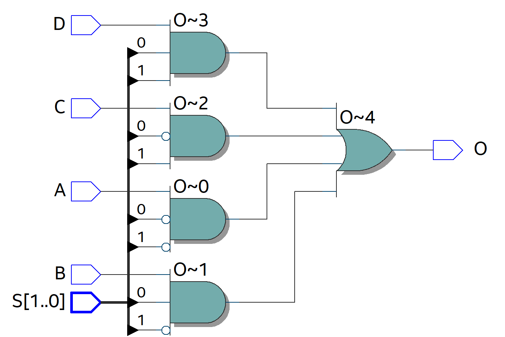

# Exercise 1 – Multiplexer Design and Modeling Styles

## Overview

This exercise focuses on designing and simulating multiplexers using **VHDL**. The goal was to implement a **4:1 multiplexer** using three different VHDL modeling styles and verify their correctness through simulation.

The exercise also demonstrates how a design can be **scaled from 1-bit to 8-bit** and how the same testbench can be reused across different modeling approaches.

## Objectives

- **Design a 4:1 multiplexer using three distinct approaches:**
    * Dataflow modeling
    * Behavioral modeling
    * Structural modeling

- **Scale the architecture:** Implement an 8-bit wide version of the 4:1 multiplexer.
- **Verification:** Create and reuse a single VHDL testbench across all modeling approaches.
- **Simulation:** Validate all designs using ModelSim waveform analysis.

## Hardware Interface (Entity Specification)

The core 4:1 multiplexer architecture utilizes the following hardware interface: 

- **Inputs:** `A`, `B`, `C`, `D` (Data Lines), `S` (2-bit Select Line)
- **Outputs:** `O` (Routed Data Output)

### Block Diagram


*Figure 1: RTL Schematic generated from Intel Quartus Prime showing the internal routing logic and component instantiation*

## Tools & Environment
| Component | Technology / Tool Used |
| ---- | ---- |
| HDL | VHDL |
| FPGA Toolchain | Intel Quartus Prime Lite (18.1)|
| Simulator | ModelSim - Intel FPGA Starter Edition 10.5b (Quartus Prime 18.1) |
| Target Platform | Simulation-Only (Not synthesized for physical deployment) |

## Project Structure

```
exercise-1-multiplexer/
├── docs/
|   └── Multiplexer-Design-and-Modeling-Styles.pdf
|
├── figures/
|   ├── mux2to1_8bit_BD.png
|   ├── mux2to1_BD.png
|   ├── mux4to1_8bit.png
|   ├── mux4to1_BD.png
|   ├── mux4to1_RTL.png
|   ├── mux4to1_behave.png
|   ├── mux4to1_data.png
|   └── mux4to1_struct.png
|
├── src/
|   ├── Exercise1_MUX.qpf
|   ├── Exercise1_MUX.qsf
|   ├── MUX2to1.vhd
|   ├── MUX2to1_8bit.bdf
|   ├── MUX2to1_primitive.bdf
|   ├── MUX2to1_primitive.bsf
|   ├── MUX4to1_2to1MUX.bdf
|   ├── MUX4to1_8bit.vhd
|   ├── MUX4to1_8bit_TB.vhd
|   ├── MUX4to1_Behave.vhd
|   ├── MUX4to1_Behave_TB.vhd
|   ├── MUX4to1_Data.vhd
|   ├── MUX4to1_Data_TB.vhd
|   ├── MUX4to1_Struct.vhd
|   └── MUX4to1_Struct_TB.vhd
|
└── README.md

```

## Key Concepts Demonstrated

- **VHDL Modeling Paradigms:** Evaluating the practical differences and performance of Dataflow vs. Behavioral vs. Structural modeling styles.
- **Combinational Logic Design:** Implementing foundational routing structures in hardware.
- **Hierarchical Design:** Utilizing structural modeling to instantiate and connect smaller components into a larger system.
- **Data Types:** Managing `std_logic` vs. `std_logic_vector` for bus widths.
- **Functional Verification:** Constructing a robust testbench-driven framework to catch hazards and timing issues via waveform validation.

## Full Report

A complete explanation of the design process is compiled in the report. It includes:

- **Mathematical Foundations:** Boolean equations and truth tables.
- **Source Code:** Comprehensive VHDL source file listings.
- **Visuals:** System block diagrams and ModelSim simulation screenshots.
- **Analysis:** Detailed comparative design analysis and conclusions.

**[Access the Full Report Here](https://github.com/EmmanuelC40/Computer-Organization/blob/738203e579af5784395ca80afb3c4d1ae90f9cd0/exercise-1-multiplexer/docs/Multiplexer-Design-and-Modeling-Styles.pdf)**

## Author

Emmanuel Cano
