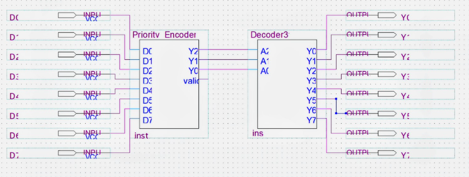
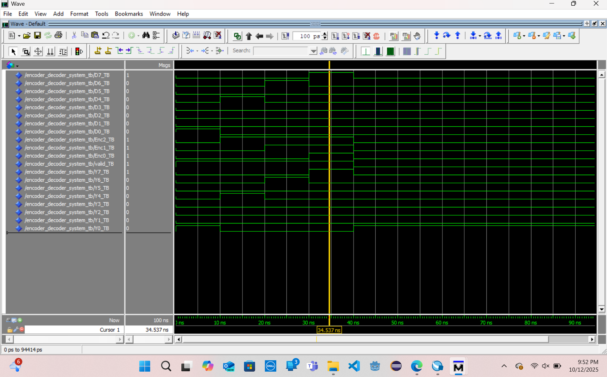

# Exercise 2 – Decoders, Encoders, and Demultiplexers

## Overview

This exercise focuses on the design and simulation of **decoders, priority encoders, and demultiplexers** using **VHDL**. These components are fundamental to digital systems and are commonly used for **data routing, control logic, and memory addressing**.

In addition to implementing each component individually, a **combinational system** was built by interconnecting an **8:3 priority encoder** with a **3:8 decoder**, demonstrating how encoded data can be transmitted and decoded back into one-hot form.

All designs were verified using **ModelSim** simulation.

## Objectives

- **Design individual routing primitives in VHDL:**
    - **3:8 Decoder:** Converting binary codes to active-high one-hot outputs.
    - **8:3 Priority Encoder:** Encoding the highest-priority active input into a binary value alongside a `Valid` bit.
    - **1:2 Demultiplexer:** Actively steering a single data stream based on a select line.
- **System Integration:** Interconnect the encoder and decoder into a unified combinational system.
- **Verification:** Validate all designs using ModelSim waveform analysis.

## Interconnected System Architecture

This model integrates an 8:3 priority encoder with a 3:8 decoder to demonstrate structural interconnection and priority resolution.

- **Inputs:** `D1`, `D2`, `D3`, `D4`, `D5`, `D6`, `D7`, `D8` (Data Lines)
- **Outputs:** `Y1`, `Y2`, `Y3`, `Y4`, `Y5`, `Y6`, `Y7`, `Y8` (Reconstructed Output), `Valid` (Encoder Status Flag)

### Block Diagram


*Figure 1: RTL schematic demonstrating cascading structural connection from the priority logic through to the decoder matrix.*

## Tools & Environment
| Component | Technology / Tool Used |
| ---- | ---- |
| HDL | VHDL |
| FPGA Toolchain | Intel Quartus Prime Lite (18.1)|
| Simulator | ModelSim - Intel FPGA Starter Edition 10.5b (Quartus Prime 18.1) |
| Target Platform | Simulation-Only (Not synthesized for physical deployment) |

## Project Structure

```
exercise-2-encoder-decoder/
├── docs/
|   └── Decoders-Encoders-Demultiplexers.pdf
|
├── figures/
|   ├── decoder3to8.png
|   ├── decoder_3to8_BD.png
|   ├── demux1to2.png
|   ├── demux_1to2_BD.png
|   ├── encoder8to3.png
|   ├── encoder_8to3_BD.png
|   ├── encoder_decoder.png
|   └── encoder_decoder_BD.png
|
├── src/
|   ├── 1to2Demux_Block_diagram.bdf
|   ├── 3to8Decoder_Block_diagram.bdf
|   ├── 8to3Encoder_Block_diagram.bdf
|   ├── Decoder3to8.bsf
|   ├── Decoder3to8.vhd
|   ├── Decoder3to8_TB.vhd
|   ├── Demux1to2.vhd
|   ├── Demux1to2_TB.vhd
|   ├── Encoder_Decoder_Block_diagram.bdf
|   ├── Encoder_Decoder_System.vhd
|   ├── Encoder_Decoder_System_TB.vhd
|   ├── Exercise_2.qpf
|   ├── Exercise_2.qsf
|   ├── Priority_Encoder8to3.bsf
|   ├── Priority_Encoder8to3.vhd
|   └── Priority_Encoder8to3_TB.vhd
|
└── README.md

```

## Key Concepts Demonstrated
- **Priority-Based Conflict Resolution:** Handling overlapping/simultaneous bus requests gracefully by prioritizing the highest-index line.
- **Hierarchical Port-Mapping:** Connecting discrete hardware entities together using local internal `SIGNAL` nets.

## Verification & Waveforms

Simulations were structured to test overlapping input conditions, verifying that the priority encoder handles multiple assertions correctly and that the decoder resolves them into the expected output.



*Figure 2: Functional verification waveform showing priority resolution and Valid bit tracking under dynamic multi-input assertion.*

## Full Report
A complete explanation of the design process is compiled in the report. It includes:

- **Source Code:** Comprehensive VHDL source file listings with design descriptions.
- **Visuals:** System block diagrams and ModelSim simulation screenshots.
- **Analysis:** Detailed comparative design analysis and conclusions.

**[Access the Full Report Here](https://github.com/EmmanuelC40/Computer-Organization/blob/c44d0e2e50ca5ff6dedd2f6fef51efb461d9109a/exercise-2-encoder-decoder/docs/Decoders-Encoders-Demultiplexers.pdf)**

## Author

Emmanuel Cano
