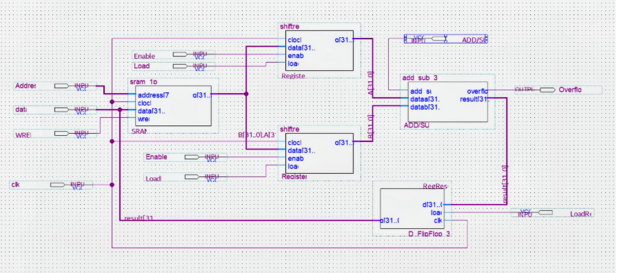
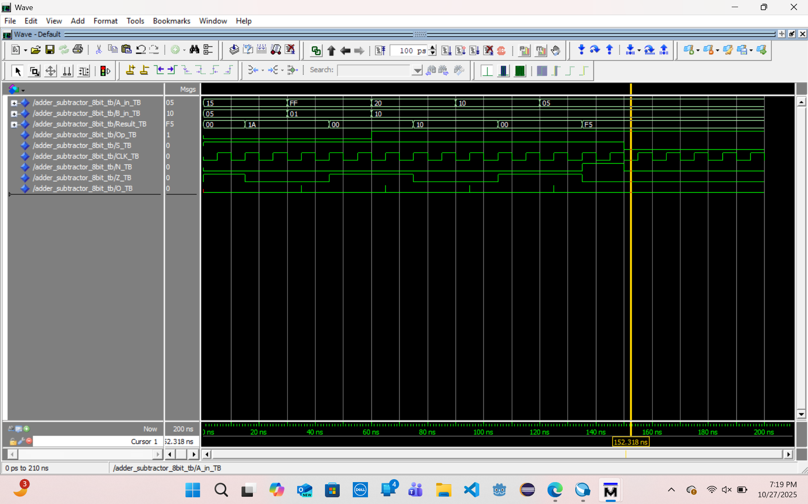

# Exercise 3 – Datapath Design Using LPM Components

## Overview

This exercise focuses on designing and simulating a **simplified CPU-style datapath** using **VHDL** and **Intel Quartus LPM (Library of Parameterized Modules)** components. 

Unlike previous exercises, this design incorporates **clocked sequential logic**, including registers and memory, to model how data moves and is processed over time in a processor datapath.

The datapath supports reading operands from memory, performing arithmetic operations using an ALU, and writing results back to memory. Functional correctness was verified using **ModelSim** simulations.

## Objectives

- **Design a Synchronous Processor Datapath:** Synthesize registers, SRAM, and an ALU into a unified execution loop.
- **Implement Multi_Bit Registers:** Build structural 32-bit registers utilizing discrete D Flip-Flop configurations featuring asynchronous resets and synchronous load enables.
- **Leverage Vendor LPM Components:** Harness Intel's *Library of Parameterized Modules* for highly scalable and optimized arithmetic and memory hardware block generation.
- **Incorporate Arithmetic Flags:** Design real-time hardware addition and subtraction execution paths featuring dedicated **Overflow Detection** logic. 
- **Verify Sequential Control Paths:** Validate precise setup/hold execution windows and state-tracking relative to system clock transitions. 

## Datapath Execution Flow

This system integrates sequential registers, an LPM-based arithmetic logic unit, and an initialized SRAM block to create a synchronous data-processing loop.

$$\text{SRAM} \longrightarrow \text{Register A/ Register B} \longrightarrow \text{ADD/SUB Unit (ALU)} \longrightarrow \text{Result Register} \longrightarrow \text{SRAM}$$

### Block Diagram



*Figure 1: Complete hardware block schematic showing the data-loop integration between the LPM memory blocks, latching registers, and the ALU arithmetic flags*

## Tools & Environment
| Component | Technology / Tool Used |
| ---- | ---- |
| HDL | VHDL |
| FPGA Toolchain | Intel Quartus Prime Lite (18.1)|
| Simulator | ModelSim - Intel FPGA Starter Edition 10.5b (Quartus Prime 18.1) |
| Design Libraries | Intel LPM (Library of Parameterized Modules) |
| Memory Config | MIF (Memory Initialization File) format |
| Target Platform | Simulation-Only (Not synthesized for physical deployment) |

## Project Structure

```
exercise-3-datapath/
├── docs/
|   └── Datapath-Design-Using-LPM-Components.pdf
|
├── figures/
|   ├── adder_subtractor_8bit.png
|   └── adder_subtractor_8bit_BD.png
|
├── src/
|   ├── D_FlipFlop_32bit.bsf
|   ├── D_FlipFlop_32bit.vhd
|   ├── Exercise3.qpf
|   ├── Exercise3.qsf
|   ├── add_sub.bdf
|   ├── add_sub_32bit.qip
|   ├── add_sub_32bit.qip
|   ├── memory.mif
|   ├── shiftreg.bsf
|   ├── shiftreg.qip
|   ├── shiftreg.vhd
|   ├── sram_1port.qip
|   ├── sram_1port.vhd
|   ├── testbench.vhd
|   └── toplevel.vhd
|
└── README.md

```

## Key Concepts Demonstrated
- **Sequential Logic Design:** Learning how to use clock edges (`rising_edge(CLK)`) to control exactly when data moves into a register.
- **Using Pre-Built Blocks (Intel LPM):** Using ready-made intel modules (`LPM_ADD_SUB`) to easily build scalable memory and arithmetic units.
- **Pre-Loading Memory (MIF Files):** Working with Memory Initialization Files to automatically load test data into the RAM before running the simulation.
- **Arithmetic Error Handling:** Distinguishing between standard logical carries and signed arithmetic two's-complement overflow exceptions. 

## Simulation and Verification
The synchronous testbench environment subjects the datapath to multiple processing phases. Waveform analysis verifies that the memory read addresses, register latches, ALU evaluations, and memory write-backs occur within the strict clock boundaries without race hazards. 



*Figure 2: ModelSim simulation showing synchronous data latching, mathematical processing, and real-time overflow flag tracking.*

## Full Report
A complete explanation of the design process is compiled in the report. It includes:

- **Source Code:** Comprehensive VHDL source file listings.
- **LPM configuration details**
- **Visuals:** System block diagrams and ModelSim simulation screenshots.
- **Analysis:** Detailed comparative design analysis and conclusions.

**[Access the Full Report Here](https://github.com/EmmanuelC40/Computer-Organization/blob/b3534e46e55dee50db9de5be4d75cb2a51507eba/exercise-3-datapath/docs/Datapath-Design-Using-LPM-Components.pdf)**

## Author

Emmanuel Cano
